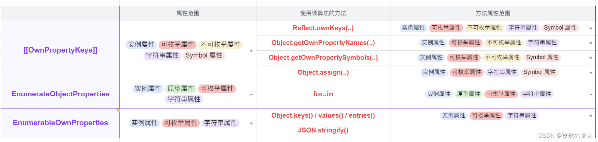

# 对象遍历

可能有些同学听过在 JavaScript 中遍历对象顺序不固定的这一说法。事实上，这个说法不是特别准确。
对待遍历顺序，对象有一套自己既定的规则，在此规则下呢，对象的遍历顺序会受插入元素顺序的影响，但是不完全受插入元素先后顺序的影响。如果您有「必须按插入元素顺序遍历」的场景，可以考虑使用 Map。

遍历对象的方法有很多种，我们经常会使用的有：
- `for...in`
- `Object.keys`
- `Object.entries`
- `Obejct.getOwnerProPertyNames`
- `Reflect.ownKeys`
- ......

上面我们列的几个方法，都按照一样的规则去遍历对象。而实际的遍历规则会根据 key 值类型的不同而不同。

对象的索引值的类型不仅可以是字符串，还可以是 Symbol 类型。

## 00. 从规范中定义的算法说起

在 ES6 之前，一个对象属性（键）的**遍历顺序**依赖于浏览器的具体实现，并未在规范中定义。  
多数引擎采用的是按照 **创建顺序** 进行枚举。

**ES6** 规范新增了一些算法的定义，来规范对象属性的遍历顺序。包括：

- [[OwnPropertykeys]]
- [[Enumerate]]（于 ES2016/ES7 废除），变更为抽象方法 `EnumerateObjectProperties`

## 01. [[OwnPropertykeys]]

### 1.1 遍历属性的范围

这个算法会产生对象的 **所有实例属性** （即自身拥有的，而非继承来的）

- 包括 **字符串属性** 和 **Symbol 符号属性**
- 无论是否可枚举

### 1.2 使用该算法的方法

- `Reflect.ownKeys(..)`
  - 返回由 目标对象 自身的属性键 组成的数组，可获取不可枚举属性和 Symbol，不可获取原型。
  - 相当于 `Object.getOwnPropertyNames()` 与 `Object.getOwnPropertySymbols()` 得到的两个数组进行拼接。
- `Object.getOwnPropertyNames(..)`
  - 返回由 目标对象 自身的字符串属性键 组成的数组
- `Object.getOwnPropertySymbols(..)`
  - 返回由 目标对象 自身的 Symbol 属性键 组成的数据
- `Object.assgin(target, ...sources)`
  - 将所有 可枚举的自身的属性 从 一个或多个源对象 复制到 目标对象，返回修改后的对象。
  - 其中对于每一个源对象，都是用 `[[ownPropertyKeys]]`算法枚举（列出）其属性键，并过滤出可枚举的属性。

案例：

```js
const uid = Symbol("id");
const p = {
  position: "south",
  foods: ["rice", "fruit"],
};
const o = {
  uid: "001",
  name: "ct",
  age: 26,
  gender: "male",
  married: false,
  hobbies: ["football", "swimming"],
  langs: {
    chinese: 8,
    english: 2,
    japanese: 0,
  },
};
o[Symbol("finger")] = "finger-xxxxxx";
o[Symbol("skin")] = "skin-xxxxxx";

Object.setPrototypeOf(o, p); // 设置 o 原型对象为 p

Object.defineProperty(o, "age", {
  enumerable: false,
});

console.log("Reflect.ownKeys(o)--", Reflect.ownKeys(o)); // ['uid', 'name', 'age', 'gender', 'married', 'hobbies', 'langs', Symbol(finger)]

console.log("Object.getOwnPropertyNames(o)--", Object.getOwnPropertyNames(o)); // ['uid', 'name', 'age', 'gender', 'married', 'hobbies', 'langs']

console.log(
  "Object.getOwnPropertySymbols(o)--",
  Object.getOwnPropertySymbols(o)
); // [Symbol(finger), Symbol(skin)]

console.log("Object.assign({}, o)--", Object.assign({}, o)); // {uid: '001', name: 'ct', gender: 'male', married: false, hobbies: Array(2), langs: {…}, Symbol(finger): 'finger-xxxxxx', Symbol(skin): 'skin-xxxxxx'}
```

### 1.2 遍历顺序

这个算法定义了一个对象属性的遍历顺序：

1. 先按照 **数字上升的排序**，枚举所有的 **整数属性**
2. 再按照 **创建顺序** 枚举其余的 **字符串属性**
3. 最后按照 **创建顺序** 枚举拥有的 **Symbol 符号属性**

案例：

```js
const order = {
  name: "order",
  6: 6,
  5: 5,
  age: 26,
  "09": 9,
  "+9": "+9",
  7.8: 7.8,
  7: 7,
  3: 3,
  4: 4,
};
order[Symbol("order1")] = "so1";
order["gender"] = "male";
order[Symbol("order2")] = "so2";

console.log("Reflect.ownKeys(order)--", Reflect.ownKeys(order)); // ['3', '4', '5', '6', '7', 'name', 'age', '09', '+9', '7.8', 'gender', Symbol(order1), Symbol(order2)]

console.log(
  "Object.getOwnPropertyNames(order)--",
  Object.getOwnPropertyNames(order)
); // ['3', '4', '5', '6', '7', 'name', 'age', '09', '+9', '7.8', 'gender']

console.log(
  "Object.getOwnPropertySymbols(order)--",
  Object.getOwnPropertySymbols(order)
); // [Symbol(order1), Symbol(order2)]

console.log("Object.assign({}, order)--", Object.assign({}, order)); // {3: 3, 4: 4, 5: 5, 6: 6, 7: 7, name: 'order', age: 26, 09: 9, +9: '+9', 7.8: 7.8, gender: 'male', Symbol(order1): 'so1', Symbol(order2): 'so2'}
```

> NOTE:  
> 在一个对象中，如果我们的 key 值是像 '1'、'200'这种正整数格式的字符串。 列出的顺序是按照 key 值的大小来排列的。  
> 我们最后的遍历顺序完全忽视了插入顺序，并且，值得我们注意的是，在对象中，就算我们添加属性时的索引值是 Number 类型，最后的结果还是会被隐式的转为字符串。  
> 另外，如果我们的 key 值是正、负整数的字符串（ 如 '+1'，'-1' ）、小数格式的字符串(如 '1.0' ) 和其他的字符串（如 01）。他们的列出顺序会比较符合直觉，就是插入对象的顺序。

在极客时间的李兵老师的图解 Google V8 的第三节 "V8采用了哪些策略提升了对象属性的访问速度？" 时，有更深层次的解释。

如下图：V8 里的对象其实维护两个属性，会把数字放入线性的 elements 属性中，并按照顺序存放。会把非数字的属性放入 properties 中，不会排序，顺便说一句它可能是线性结构，取决于属性数量的多少。遍历属性时先 elements 而后再 properties。


相信到这里，大家已经完全明白了对象的遍历顺序问题，最后还有一点值得大家注意的点，是 for...in 的遍历顺序问题。

最开始的时候，for...in 的遍历顺序并没有一个统一的标准，浏览器厂商会按照他们的喜好去设置 for...in 的遍历顺序。如果您对遍历顺序有要求并且要兼容老的浏览器版本，建议不使用它。后来 ES 2019 的 一个提案 对此现象进行了规范，现在 for...in 的顺序也遵循上面的规则。

尽管会遵循上面的规则，但是 for...in 还会遍历原型的属性。所以 for...in 的变量元素的规则是先按照我们上面讲的对象遍历规则去变量对象本身，接下来再按照此规则去遍历对象的原型，以此类推，直到遍历到顶部。

## 02 for..in

`for..in`使用`[[enumerate]]`(ES6) / `EnumerateObjectProperties`(ES7+)来遍历属性。

> NOTE: `[[enumerate]]` 于 ES2016 / ES7 中废弃，更换为使用 抽象方法 `EnumerateObjectProperties`。 同时，在 ES2016 中还废弃了 `Reflect.enumerate(..)` 方法。

### 2.1 遍历的属性的范围

**对象实例上** 和其**原型链上**（即自身拥有的以及继承来的属性）的**可枚举属性**。只会遍历 **字符串属性**，忽略 Symbol 属性。

### 2.2 遍历的顺序

在 **ES2015** 中，由于兼容性原因，`[[enumerate]]` 并未规定对象属性的列出顺序，可以观察到的顺序和具体的浏览器实现相关。 即规范只限制了列出属性的范围，而没有限制列出的顺序。

在 **ES2016** 中， 中，使用抽象方法 `EnumerateObjectProperties` 替代了 `[[enumerate]]`，但同样没有规定对象属性列出的顺序。

从 **ES2020** 开始，即使是较旧的操作如 `for..in`、`Object.keys` 也需要遵循 属性顺序（property order，即 `[[OwnPropertyKeys]]` 中定义的顺序）。

```js
const p = {
  p1: 'p1',
  p2: 'p2'
}

const order = {
  name: 'order',
  '6': 6,
  '5': 5,
  age: 26,
  '09': 9,
  '+9': '+9',
  '7.8': 7.8,
  '7': 7,
  3: 3,
  4: 4,
}
order[Symbol('order1')] = 'so1'
order['gender'] = 'male'
order[Symbol('order2')] = 'so2'

Object.setPrototypeOf(order, p)

Object.defineProperty(order, "age", {
  enumerable: false,
});

console.log('order--', order)

for (const key in order) {
  const v = order[key]
  console.log('key--', key, 'v--', v)
}
// key-- 3 v-- 3
// key-- 4 v-- 4
// key-- 5 v-- 5
// key-- 6 v-- 6
// key-- 7 v-- 7
// key-- name v-- order
// key-- 09 v-- 9
// key-- +9 v-- +9
// key-- 7.8 v-- 7.8
// key-- gender v-- male
// key-- p1 v-- p1
// key-- p2 v-- p2
```

### 03 Object.keys()

规范定义，Object.keys() 使用 [EnumerableOwnProperties](https://tc39.es/ecma262/multipage/abstract-operations.html#sec-enumerableownproperties)  抽象方法产生对象属性列表。
- 在这个抽象方法当中，通过调用 `[[OwnPropertyKeys]]` 算法取得拥有的所有键的列表。
- 然后过滤掉 不可枚举 `[[Enumerable]] === false` 的属性 和 Symbol 的属性。
- 在 ES2020 前内部可能会将列表重新排列来与 `for..in`  的属性顺序相匹配。

与此相似
- `Object.values()`
- `Object.entries()`
- `JSON.stringify()`（转换对象为JSON，遍历需要使用的对象属性列表）
也是使用同样的抽象方法 `EnumerableOwnProperties` 来生成属性/值的列表

### 3.1 遍历属性的范围
`Object.keys()`会返回由目标对象的**实例上的**（自身拥有的属性，而非继承来的）**可枚举**属性组成的数组。

### 3.2 遍历顺序
属性顺序与 `for..in`保持一致。

```js
const p = {
  p1: 'p1',
  p2: 'p2'
}

const order = {
  name: 'order',
  '6': 6,
  '5': 5,
  age: 26,
  '09': 9,
  '+9': '+9',
  '7.8': 7.8,
  '7': 7,
  3: 3,
  4: 4,
}
order[Symbol('order1')] = 'so1'
order['gender'] = 'male'
order[Symbol('order2')] = 'so2'

Object.setPrototypeOf(order, p)

Object.defineProperty(order, "age", {
  enumerable: false,
});

console.log('order--', order)

// for (const key in order) {
//   const v = order[key]
//   console.log('key--', key, 'v--', v)
// }

const orderKeys = Object.keys(order)
console.log('orderKeys--', orderKeys) // ['3', '4', '5', '6', '7', 'name', '09', '+9', '7.8', 'gender']
```

### 04 for of
`for..of`可以遍历可迭代对象，即实现了`Symbol.iterator`方法的对象。

### 4.1 遍历顺序
遍历的顺序为调用`Symbol.iterator`工厂方法返回的迭代器中，next()方法的返回值顺序。

## 总结
1. ES6 前没有明确地规范 对象属性的列出顺序。
2. ES6 定义了新的算法 `[[ownPropertyKeys]]`，规定了对象属性的列出顺序。
  - 使用该算法的方法： 
    - Reflect.ownKeys()
    - Object.getOwnPropertyNames()
    - Object.getOwnPropertySymbols()
    - Object.assign()
  - 此时为了兼容性，`for..in`，`Object.keys()`，`JSON.stringify()`， 一系列方法的属性顺序没有进行规定，仍然是由浏览器自行实现。不过这些方法的属性顺序表现一致。
3. ES2020 开始，`for..in`，`Object.keys()`， 这些旧方法也需要遵循 `[[ownPropertyKeys]]` 中定义的属性顺序。

